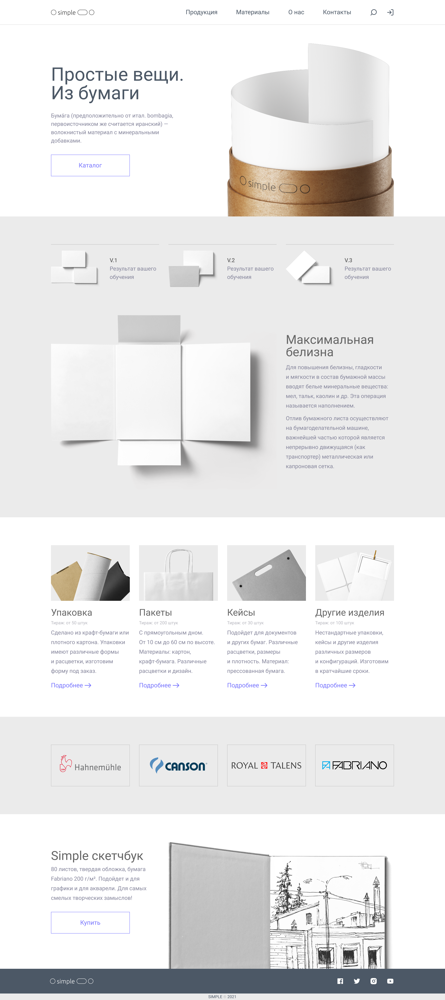

# 🌐 My Projects

Hi! I build modern, responsive websites with a focus on semantic HTML, UX, and clean code.

Below you can find some of the projects I’ve worked on:

## 📑 Table of Contents
- [🧱 Simple](#-simple)
- [🎨 Zero](#-zero)

---

- [💬 Feedback](#-feedback)

---

### 🧱 [Simple](https://ilya33-s.github.io/Portfolio/Simple/)
**Description:**  
A minimalist product showcase website with a clean layout and semantic markup. This project demonstrates structured, responsive layout techniques and polished UI.

**Technologies:**  
HTML5, CSS3 (Flexbox, Grid), BEM methodology

**Desktop Preview:**  

---

### 🎨 [Zero](https://ilya33-s.github.io/Portfolio/Zero/)
**Description:**  
A clean and lightweight landing page designed to present products in a modern and elegant layout. Built with accessibility and maintainability in mind, this project showcases semantic structure and responsive styling.

**Technologies:**  
HTML5, CSS3 (Flexbox, Grid), BEM methodology

**Desktop Preview:**  

---

### 💬 Feedback
**Have a question or feedback?**  
Feel free to [contact me via email](mailto:ilya.kroft@gmail.com)

